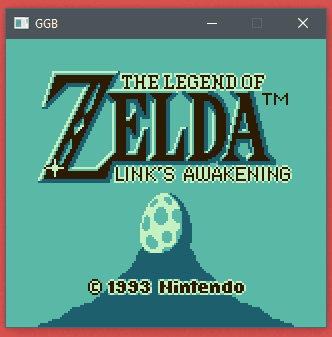
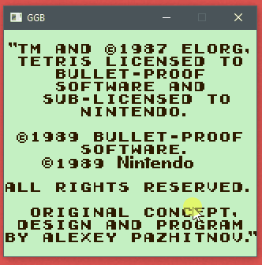
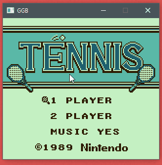
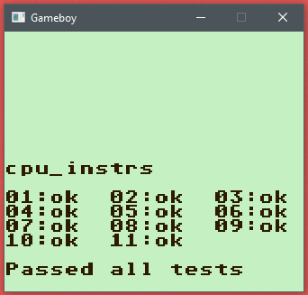
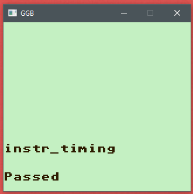
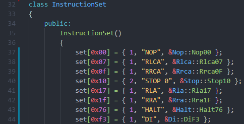
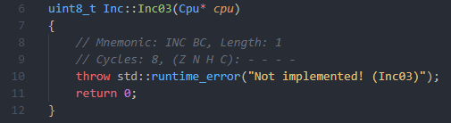

# GGB - A Game Boy emulator written in C++ (WIP)

## Compatibility

*It is not intended to provide a full compatibility for all available cartridges.*
*Or to implement every single quirk of the Game Boy Hardware.*

This is a *programming experience project* and it does not aim to be a daily use emulator to play with. 
Use other great emulators for this purpose. For example:
- [Gambatte](https://github.com/sinamas/gambatte)
- [Sameboy](https://sameboy.github.io/)
- [BGB](http://bgb.bircd.org/)
- [Visualboy Advance](https://github.com/visualboyadvance-m/visualboyadvance-m)

## Screenshots

| Zelda   |      Tetris      |  Tennis |
|-------------------|------------------|---------|
|  |   |  |

| Blargg CPU Test   |      Blargg Instr Timing       |
|-------------------|--------------------------------|
|  |   |

## Aims

Primary aims were:
- get a common understanding of emulation and the interaction of the components
- learn a bit about sound programming by implementing the APU

Further more I wanted to get the CPU to do its work correctly, but I did not want to get it as accurate as possible.
Thats why this emulator uses a rather simple cycle count method to keep the components in sync (Components syned after each instruction).
Which should be enough for most cases. There are more accurate methods like described [here](https://gekkio.fi/blog/2015/mooneye-gb-a-gameboy-emulator-written-in-rust/). 

I also tried to get the timer implementation to behave like the real hardware.
Most of the behaviours described in [The Cycle-Accurate Game Boy Docs](https://github.com/AntonioND/giibiiadvance/blob/master/docs/TCAGBD.pdf) are working, passing most of [Mooneyes Timer Tests](https://github.com/Gekkio/mooneye-gb/tree/master/tests/acceptance/timer).
In contrast to other implementations, I let the timer use the *correct* internal clock in memory to increase the TIMA and DIV.

## Controls

SPACE = Select  
ENTER = Start  
Z = B  
X = A  
DIRECTIONS = Arrow Keys  

P = Pause/Play  
N = Next instruction  
D = Open Debugger

## Opcode Generator

After I started this project I used this [table](http://www.pastraiser.com/cpu/gameboy/gameboy_opcodes.html) to create my opcode classes.
Pretty fast I was frustrated by this tedious task. Therefore I created a python script to automate it.
The script *genOpcodes.py*, in the *gen* folder, scrapes the table and creates C++ classes by using the templates in the *gen/templates* folder.
By using this script I got great frame classes to work in.

The top *instruction_set* class contains two maps including all the different opcodes.  

**WARNING:** 

*The Pastraiser OpCode Table has a few bugs. 0xE2 and 0xF2 are only one byte long! The Carry Flag indicator for the Right Shifting operations seems to be wrong, too. CBxBit 16 Bit operations are only 12 cycles, not 16! Just use [this](https://izik1.github.io/gbops/) more accurate table by izik1, if you need it!*



Furthermore the script creates frame classes for all opcode groups.  



## Instruction struct

The top *instruction_set* class contains two arrays. Including all opcodes.

```cpp
typedef uint8_t (*OpcodeFunc)(Cpu*);
struct Instruction
{
    uint8_t length;                 // Byte Length of the Instruction
    char* mnemonic;                 // Mnemonic of the Instruction
    OpcodeFunc executeInterpreter;  // Function Pointer to execute interpreter mode for given opcode
};
```

## Ressources

- 8080 Manual (see *docs folder* - really great to understand how a cpu works)
- [The Cycle-Accurate Game Boy Docs](https://github.com/AntonioND/giibiiadvance/blob/master/docs/TCAGBD.pdf) (Back up in the *docs* folder)
- [Pandocs](http://bgb.bircd.org/pandocs.htm) (Backup of the Site in the *docs folder*)
- [Opcodes](http://www.devrs.com/gb/files/opcodes.html)
- [Opcodes Table](http://www.pastraiser.com/cpu/gameboy/gameboy_opcodes.html)
- [Opcodes Table (the better one)](https://izik1.github.io/gbops/)
- [Memory Map](http://gameboy.mongenel.com/dmg/asmmemmap.html)
- [Game Boy - Sound Hardware](https://gbdev.gg8.se/wiki/articles/Gameboy_sound_hardware)
- [Game Boy - CPU Manual](https://realboyemulator.files.wordpress.com/2013/01/gbcpuman.pdf) (Backup of the Site in the *docs folder*)
- [Ultimate Game Boy Talk](https://www.youtube.com/watch?v=HyzD8pNlpwI)