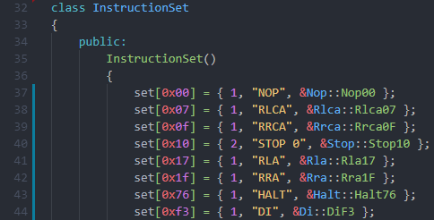
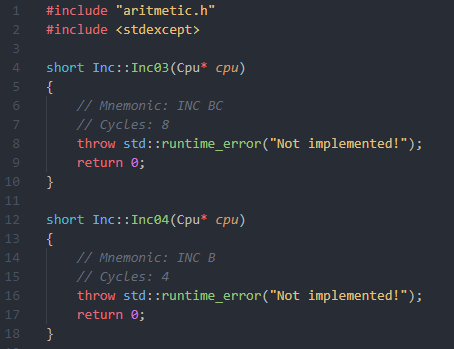

# A Gameboy emulator written in C++ (WIP)

I started this project to create a cycle accurate emulator which is capable to do emulation in **interpreter mode** and in **jit mode**.
The aim was to create a code base which is easy to follow for beginners.

## Compatibility

It is not intended to provide a full compatibility for all available cartridges. It only supports non MBC cartridges.
This is a programming experience project and it does not aim to be a daily use emulator to play with. 
Use other great emulators for this purpose. For example:
- [Gambatte](https://github.com/sinamas/gambatte)
- [Visualboy Advance](https://github.com/visualboyadvance-m/visualboyadvance-m)

## Opcode Generator

After I started this project I used this great [table](http://www.pastraiser.com/cpu/gameboy/gameboy_opcodes.html) to create my opcode classes.
Pretty fast I was frustrated by this tedious task. Therefore I created a python script to automate it.
The script *genOpcodes.py*, in the *gen* folder, scrapes the table and creates C++ classes by using the templates in the *gen/templates* folder.
By using this script I got great frame classes to work in.

The top *instruction_set* class contains two maps including all the different opcodes.  



Furthermore the script creates frame classes for all opcode groups.  



## Instruction struct

The top *instruction_set* class contains two maps. The key of the maps are the opcode of the instruction,
and the value of the map is of type *struct Instruction*.

```cpp
typedef uint8_t (*OpcodeFunc)(Cpu*);
struct Instruction
{
    uint8_t length;                 // Byte Length of the Instruction
    std::string mnemonic;           // Mnemonic of the Instruction
    OpcodeFunc executeInterpreter;  // Function Pointer to execute interpreter mode for given opcode
    //TODO OpcodeFunc? eecuteJit;   // Function Pointer to execute jit mode for given opcode
};
```

## TODOs
- Implement CPU         (WIP)
- Implement Graphics    
- Implement Interpreter (WIP)
- Implement JIT

## Ressources

- 8080 Manual (see docs folder - really great to understand how a cpu works)
- http://bgb.bircd.org/pandocs.htm
- http://www.devrs.com/gb/files/opcodes.html
- http://gbdev.gg8.se/wiki/articles/Main_Page
- http://gameboy.mongenel.com/dmg/asmmemmap.html
- http://www.pastraiser.com/cpu/gameboy/gameboy_opcodes.html